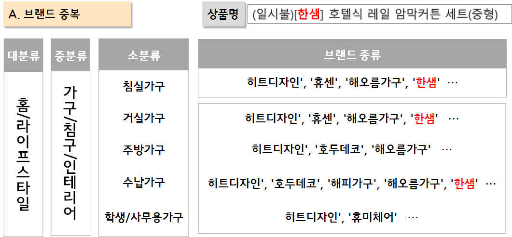

# WANPANMAN

## Team Git : https://github.com/hsu-201458085/Big_Con_Wanpanman

## [ Task ]

### 1. 동시간대 판매 상품 개수 분석

* 동일한 방송에서 여러개의 상품을 판매(상품코드가 많음), 상품코드 개수가 많을수록 판매단가가 높음


실제로 Random Forest 모델에서 중요한 feature


### 2. 노출 시간 분석

방송이 초반에서 후반으로 갈수록 취급액이 증가하는 경향이 있음 ( 그렇지 않은 경우도 존재 )

-> 비율을 사용하고자 함.


※ label인 취급액을 직접 활용하기 때문에 직접적인 사용이 어려움. 우회하는 방법 필요

-> 방송 단위별로 합한 뒤에, 비율을 곱해주는 방법


### 3. 마더코드, 상품코드 분석

하나의 마더코드 안에 여러개의 상품에 대한 상품코드 존재 ( 상품코드 : 일시불, 무이자, 옵션, 할인 등의 정보 포함 )

```
EX )
마더코드 : LG 전자
	상품코드 1 : 일시불 에어컨
	상품코드 2 : 무이자 에어컨
	상품코드 3 : 일시불 TV A형
	상품코드 4 : 무이자 TV A형
	상품코드 5 : 일시불 TV B형
	상품코드 6 : 무이자 TV B형
```

-> 하나의 마더코드 안에서 에어컨, TV가 분리되지 않은 상황

```
구현하고자 하는 것 )
마더코드 : LG 전자
	세미코드 1 : 에어컨
		상품코드 1 : 일시불 에어컨
		상품코드 2 : 무이자 에어컨
	세미코드 2 : TV
		상품코드 3 : 일시불 TV A형
        상품코드 4 : 무이자 TV A형
        상품코드 5 : 일시불 TV B형
        상품코드 6 : 무이자 TV B형
```

여기에 더하여, Test 데이터에는 새롭게 등장하는 마더코드와, 상품코드가 반 이상이기 때문에 마더코드와 상품코드로는 상품 분류 및 판매액 예측이 불가능함.


### 4. 상품명 분석 

#### 4.1 카테고리화

현재 상품의 '키워드'를 추출하여 nsmall에서 크롤링한 카테고리 기준에 맞게 분류해주고자 함.

##### 1_ 브랜드 활용 : 결과가 좋지 않음

문제 1 : 브랜드 중복



문제 2 : 브랜드 정의 불분명(크롤링 데이터)


문제 3 : 글자의 한계

'웰' 이라는 브랜드 이름이 상품명에 있을 경우, 패션의류로 분류를 할텐데 실제 카테고리는 주방, 생활용품인 경우


##### 2_ DOC2VEC

: 상품명과 카테고리를 Document로 하여, 코사인 유사도를 계산한다. 가장 높은 유사도 값을 보이는 카테고리로 분류


BUT, 상품명의 길이가 굉장히 짧기 때문에 정확도를 높이기가 어렵다. 다른 방법 필요 !!!


.

.

.

ON GOING

.

.

.